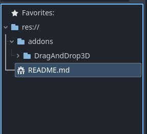

# Godot_DragAndDrop3D_plugin
 
A universal Drag and Drop System for Godot version 4.X

## 🌟 Highlights

- easy to use
- light weight

## 🚀 Usage
 DragAndDrop3D - Add it to your scene to activate the Drag and Drop System

 DraggingObject3D - This must be the Parent of your Object that you want to drag

## ⬇️ Installation
If you don't have a "addons" folder in your project tree:

    copy the "addons" folder in your project tree
    
elif you have a "addons" folder already:

    copy the "DragAndDrop3D" folder in you project tree

At the end it should look like this:

